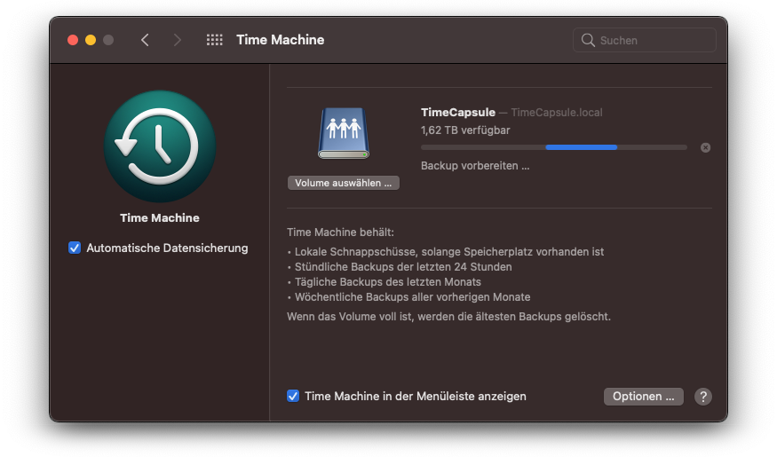

# Time Capsule on Raspberry Pi

Running Time Machine Server on Raspberry Pi using an exFAT HDD

Inspired by [macOS Backup Raspberry Pi als NAS mit TimeMachine](https://knasan.de/index.php?/archives/10-macOS-Backup-Raspberry-Pi-als-NAS-mit-TimeMachine.html)



### 1. Add exFAT support

As there are no good options to use a HDD with [APFS](https://az4n6.blogspot.com/2018/01/mounting-apfs-image-in-linux.html) or [HFS+](https://pimylifeup.com/raspberry-pi-hfs/) for [read/write](https://superuser.com/questions/84446/how-to-mount-a-hfs-partition-in-ubuntu-as-read-write) with a Raspberry Pi, [exFAT](https://pimylifeup.com/raspberry-pi-exfat/) is the filesystem of choice, as it can be read by macOS which is not possible for [ext4](https://www.maketecheasier.com/mount-access-ext4-partition-mac/) without any additional tools.

- Update dependencies
  
    ```sh
    sudo apt-get update
    sudo apt-get upgrade
    ```

- Install exFAT utilities
  
    ```sh
    sudo apt-get install exfat-fuse
    sudo apt-get install exfat-utils
    ```

- Format HDD with exFAT
  
    ```sh
    # replace {sdxn} with mounting point, e.g. sda1
    mkfs.exfat /dev/{sdxn}
    ```

### 2. Install Netatalk

For the Raspberry Pi to act as a NAS (Time Capsule) the program netatalk is required.

- Install netatalk
  
    ```sh
    sudo apt-get install netatalk
    ```

- Configure netatalk

    Add in configuration file `/etc/netatalk/afp.conf` (replace {NameOfHDD} with HDD name)

    ```sh
    [TimeMaschine]
    path           = /media/pi/{NameOfHDD}
    time machine   = yes
    valid users    = pi
    unix priv      = no
    ```

    To solve the problem that netatalk can't create directories on exFAT `unix priv = no` is required ([Link](https://raspberrypi.stackexchange.com/questions/74697/sharing-exfat-drive-via-netatalk-cant-create-directories))

- Restart netatalk and Raspberry Pi

    ```sh
    service netatalk restart
    sudo reboot
    ```

- Test service and drive mount (replace {NameOfHDD} with HDD name)

    ```sh
    ps aux | grep netatalk
    df /{NameOfHDD}
    mount | grep /{NameOfHDD}
    ```

### 3. Restart Netatalk after boot

As macOS doesn't recognize the backup drive after start adding a restart script is required

- Copy `scripts` folder to `/home/pi/`
- Enable system service to run `restart.sh` on startup

    ```sh
    sudo systemctl enable /home/pi/scripts/restart.service --now
    sudo systemctl daemon-reload
    ```

### 4. Spin-Down HDD on shutdown

In order to spin down the HDD manually or on shutdown, another script is necessary

- Copy contents of `desktop` folder to `/home/pi/desktop`
- Replace {NameOfHDD} with HDD name in `scripts/ejectHDD.sh`

Now a manual eject of HDD or shutdown including spindown of HDD is possible using the desktop shortcuts. Therefore a capable cable is required as [Startech eSATA/USB3](https://www.startech.com/de-de/hdd/usb3s2esata3) (only `RevA` is working, spindown with `RevB` doesn't work anymore)

### 5. Find Time Capsule with macOS

However, macOS does not recognize the self-created Time Capulse until the unsupported devices feature is enabled

- Enable unsupported devices on desired mac to backup

    ```sh
    defaults write com.apple.systempreferences TMShowUnsupportedNetworkVolumes 1
    ```

- Open Time Machine, search for Volumes, select `{NameOfRaspberryPi}.local`
- Login with same credentials as used to login with the raspberry
- Create Backups and enjoy :)

### Sources

- [macOS Backup Raspberry Pi als NAS mit TimeMachine](https://knasan.de/index.php?/archives/10-macOS-Backup-Raspberry-Pi-als-NAS-mit-TimeMachine.html)
- [Raspberry Pi exFAT: Adding Support for exFAT File System](https://pimylifeup.com/raspberry-pi-exfat/)
- [Sharing exFAT drive via Netatalk, can't create directories](https://raspberrypi.stackexchange.com/questions/74697/sharing-exfat-drive-via-netatalk-cant-create-directories)
- [How to Enable Support for HFS on the Raspberry Pi](https://pimylifeup.com/raspberry-pi-hfs/)
- [How to mount a HFS partition in Ubuntu as Read/Write?](https://superuser.com/questions/84446/how-to-mount-a-hfs-partition-in-ubuntu-as-read-write)
- [Mounting an APFS image in Linux](https://az4n6.blogspot.com/2018/01/mounting-apfs-image-in-linux.html)
- [Using a Raspberry Pi for Time Machine](https://mudge.name/2019/11/12/using-a-raspberry-pi-for-time-machine/)